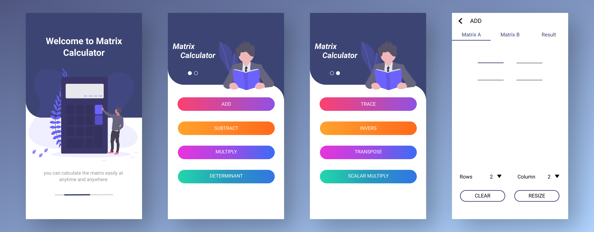

# Matrix-Calculator

This project is inspired by the [Matrix-Calculator-GUI](https://github.com/arryaaas/Matrix-Calculator-GUI) that I built previously using python. In Matrix Calculator you can calculate the matrix easily at anytime and anywhere.

## Preview App

## Features

The Matrix Calculator app lets you to calculate:
- Addition
- Subtraction
- Multiplication
- Determinant
- Trace
- Inverse
- Transpose
- Scalar Multiplication

## Requirements

minSdkVersion : 23

## License

Distributed under the MIT License. See `LICENSE` for more information.

## Contact

Mochammad Arya Salsabila - Aryasalsabila789@gmail.com
